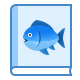

# FishDic (어류 도감)

  
<b>(주제 : 영상처리를 이용한 물고기 정보 확인 시스템)</b> 
2021 강원대학교 캡스톤디자인 팀프로젝트 1조 

---
## < 작업용 파일 설명 >
- /리소스 : 앱에서 사용 할 이미지 혹은 기타 리소스 파일들 저장하는 디렉터리
- .gitignore : Github에 업로드 시 올리지 않을 파일들 지정
- 기타 필요한 폴더 파일 자유롭게 만들어서 업로드하면됨

---
## <작업용 메모>
앱 이름은 임시로 적당히 지었음 나중에 수정가능 
Commit 메세지는 날짜 : 내용으로 적당히 넣을 것 
(ex: 2021-03-27 : DB 설계 수정)
 
---
## < For What & How it works >
앱의 목적, 작동 원리 추가

---
## < Features >
앱의 각 기능들 상세 설명 추가

---
## < Demo & Screenshot >
작동이미지 + 스크린 샷 추가

---
## < License >

