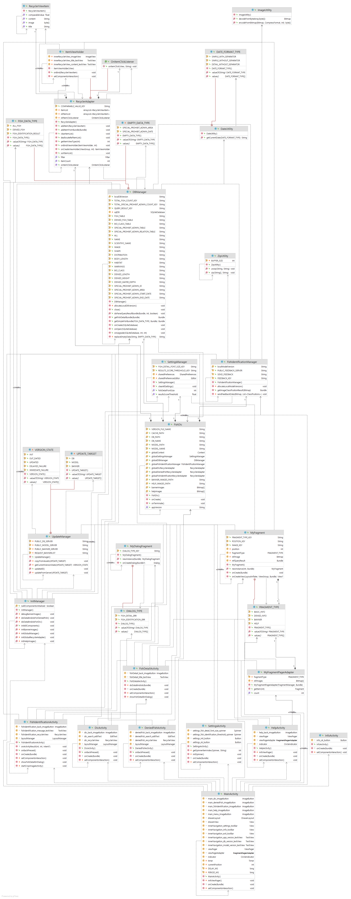

# FishDic
  

<b>(2021 Kangwon National University Department of Computer Science Capstone Design Team 1)</b> 

---
## < Project Structure Information >
- ./FishDic : 안드로이드 애플리케이션 프로젝트 디렉토리
- ./리소스 : 앱에서 사용 할 이미지 혹은 기타 리소스 파일들을 저장하는 디렉토리
- ./서버 : 서버에서 관리되는 요소들을 위한 디렉토리
- ./설계 : 프로젝트 설계 작업용 디렉토리

---
## < UML Class Diagram >

---
## < For What & How it works >

---
## < Features >

---
## < Demo & Screenshot >

---
## < System Requirement >
 <b>1) 서버 정보</b>

| Hardware | Information |
|:---|:---|
| CPU | Intel(R) Core(TM) i9-10900K |
| GPU | NVIDIA GeForce RTX 3060 |
| RAM | 16GB |

| Software | Version |
|:---|:---|
| Windows | 10 |
| Python Interpreter | 3.8.10 |
| tensorflow-gpu | 2.5.0 |
| CUDA | 11.2 |
| CuDNN | 8.1.0.77 |
| Bitnami WAMP Stack | 7.4.16 |
| OpenCV | 3.4.8 |

  
<b>2) 클라이언트 요구사항</b>

| Client | Requirement |
|:---|:---|
| Target SDK | Android Pie (9.0, API 28) or above. |
| Permissions | - READ_EXTERNAL_STORAGE - WRITE_EXTERNAL_STORAGE - CAMERA - READ_PHONE_STATE - WAKE_LOCK|

---
## < License >
  
어류 정보 및 금어기 정보는 국립수산과학원에서 제공하는 자료를 바탕으로 제작하였다.

  
어류 판별 모델 제작 시에 Tensorflow에서 제공하는 Keras를 이용하였다. 
어류 판별 시에 Tensorflow에서 제공하는 TFLite 모듈을 이용하였다.
  
<b>Copyright 2021. "2021-KNU-Capstone-Team1" All Rights Reserved.</b>  
