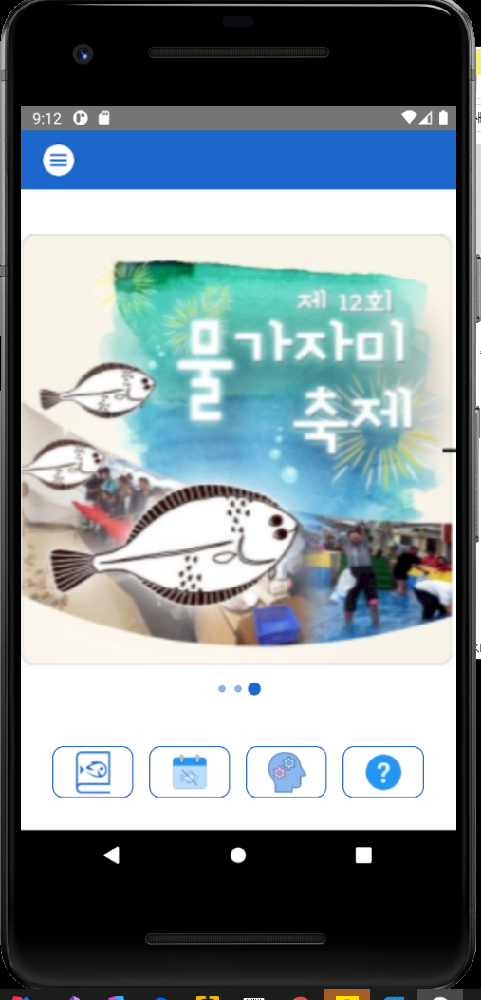
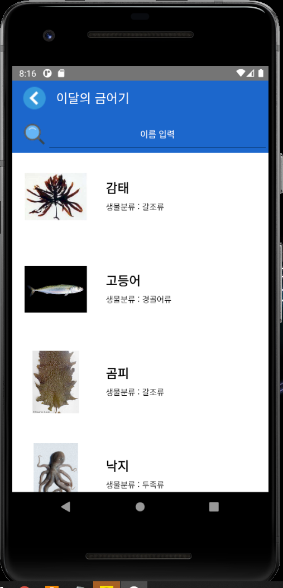

# FishDic
  

#### 
 Image Processing을 이용한 어류 정보 제공 시스템

#### 
(2021 Kangwon National University Department of Computer Science Capstone Design Team 1)

---
## < Directory Structure Information >
    ./FishDic : 안드로이드 애플리케이션 프로젝트 디렉토리
    ./리소스 : 앱에서 사용 할 이미지 혹은 기타 리소스 파일들을 저장하는 디렉토리
    ./서버 : 서버에서 관리되는 요소들을 위한 디렉토리
    ./설계 : 프로젝트 설계 작업용 디렉토리

---
## < For What & How it works >
test

---
## < Features >
<b>1. 어류 정보 제공</b> 

    전체 어류에 대한 이름, 학명, 생물분류, 개통분류, 서식지, 분포, 형태, 몸길이, 이미지, 금어기 정보 제공

<b>2. 이달의 금어기 정보 제공</b> 

    이달의 금어기에 대한 이름, 학명, 생물분류, 개통분류, 서식지, 분포, 형태, 몸길이, 이미지, 금어기 정보 제공

<b>3. 어류 판별</b> 

    사용자로부터의 사진 입력을 통해 해당 사진과 일치 혹은 유사한 모든 어류 정보 제공

<b>4. 이용 가이드</b> 

    앱의 각 기능들에 대한 사용 방법 제공

<b>5. 유지관리 및 확장성</b>

    5-1) 서버로부터 최신 어류 데이터베이스 업데이트 제공
    5-2) 지속적인 어류 판별 인식률 향상을 위해 사용자로부터의 피드백 데이터를 통한 기능 개선 제공
    5-3) 서버로부터 사용자에게 각종 행사 및 정보 제공을 위한 배너 이미지 업데이트 제공

<b>6. 안정성 및 신뢰성</b>
    
    네트워크 연결이 불가능한 극한의 상황에서도 모든 기능 정상 작동 보장

<b>- 피드백 데이터 : 사용자가 어류 판별 기능 이용 시 입력 한 이미지와 해당 이미지에 대한 판별 결과 데이터</b>

---
## < Demo & Screenshot >

 
 
 
 
 
 

---
## < System Requirement >

| Client | Requirement |
|:---|:---|
| Target Framework | Android Pie (9.0, API 28) or above |
| Permissions | - READ_EXTERNAL_STORAGE - WRITE_EXTERNAL_STORAGE - CAMERA - READ_PHONE_STATE - WAKE_LOCK|

---
## < License >
  

    어류 정보 및 금어기 정보는 국립수산과학원에서 제공하는 자료를 바탕으로 제작하였다.

    어류 판별 모델 제작 시에 Tensorflow에서 제공하는 Keras를 이용하였다.
    어류 판별 시에 Tensorflow에서 제공하는 TFLite 모듈을 이용하였다.

<b>Copyright 2021. "2021-KNU-Capstone-Team1" All Rights Reserved.</b>
