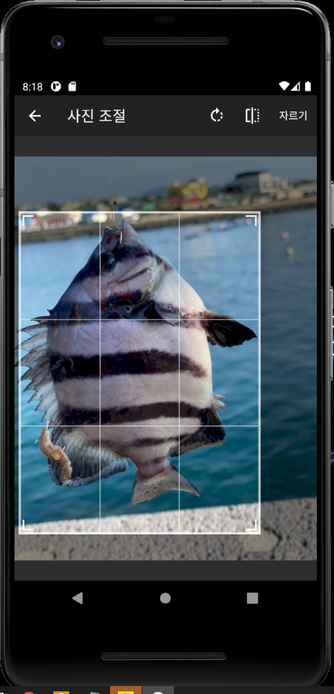

# FishDic
  

#### 
(Image Processing을 이용한 어류 정보 제공 솔루션)

##### 
2021 Kangwon National University Dept. of Computer Science & Engineering Capstone Design Team 1

---
## < Directory Structure Information >
    ./FishDic : 안드로이드 애플리케이션 프로젝트 디렉토리
    ./리소스 : 앱에서 사용 할 이미지 혹은 기타 리소스 파일들을 저장하는 디렉토리
    ./서버 : 서버에서 관리되는 요소들을 위한 디렉토리
    ./설계 : 프로젝트 설계 작업용 디렉토리

---
## < For What & How it works >

<b>1. 문제 인식</b>

 

<b><u>Figure 1) 방어와 부시리</u></b>

 

<b><u>Figure 2) 가자미류</u></b>

 

<b><u>Figure 3) 쭈꾸미와 낙지</u></b>

    1-1) 낚시를 하거나 어류를 구매하는 경우 전문가가 아닌 일반인들은 위 Figure 1) 방어와 부시리, Figure 2) 가자미류, Figure 3) 쭈꾸미와 낙지와 같이 각 어류의 외형을 보고 구분하는 것은 어려운 일이다.
    따라서, 어류에 대해서 잘 모르는 일반인들이 수산시장 등에서 물고기를 구매하는 경우 잘 모르고 비슷한 종류의 물고기를 구매하거나 속여파는 사기행위가 발생 할 수 있다.
    
    1-2) 금어기와 금지체장은 매년 해양수산부에 의해서 변경되기 때문에 낚시 전문가도 직접 찾아보지 않는다면 틀리기 쉽다.
    만약 이를 어기고 포획하는 경우 과태료가 부가되기 때문에 금어기와 금지체장에 대한 정보는 낚시꾼들에게 매우 중요하다.

    - 금어기 : 해양수산부에 의해 수산자원 고갈 위기에 대응하여 어린 물고기와 산란기 어미 물고기를 보호하기 위해 「수산자원관리법」과 같은 법 시행령을 통해 수산자원을 포획·채취할 수 없는 시기
    - 금지체장 : 일정 크기 이하의 어린 수산동식물을 포획, 채집할 수 없도록 수산자원관리법령으로 정해 놓은 제도

<b>2. 목표 설정</b>

    2-1) 위의 문제인식에 따라 우리는 어류에 대한 이름, 학명, 생물분류, 개통분류, 서식지, 분포, 형태, 몸길이, 이미지, 금어기 정보를 제공하고,
    사용자로부터의 사진 입력을 통해 해당 사진과 일치 혹은 유사한 모든 어류 정보 제공을 수행하기 위한 어류 판별 기능을 포함하는 솔루션을 제작한다.
    
    2-2) 본 솔루션은 사용자에게 어류 정보를 제공함에 있어 접근성(Accessibility) 및 편의성(Easy-To-Use)을 고려하여 보편적으로 많이 사용하는 안드로이드 휴대전화에서
    구동 가능 한 모바일 애플리케이션으로 제작하며, 항상 사용자에게 최신 어류 정보와 금어기 정보 및 정확한 어류 판별 기능을 제공하기 위하여 서버로부터의 업데이트 기능을 통해 높은 정확성(Accuracy)을 가지는 정보를 제공함을 목표로 한다.
    
    2-3) 본 솔루션의 제공되는 모든 기능에 대한 신뢰성(Reliability)을 위하여 서버와 연결이 불가능 한 극한의 상황에서도 모든 기능을 정상적으로 수행함을 목표로 한다.

<b>3. 작동 방식</b>

 

<b><u>Figure 4) 사용 사례 분석</u></b>

    전체적인 작동 방식은 위 Figure 4) 사용 사례 분석과 같다.

 

<b><u>Figure 5) 어류 도감 조회</u></b>

 

<b><u>Figure 6) 이달의 금어기 조회</u></b>

    위 Figure 5) 어류 도감 조회 및 Figure 6) 이달의 금어기 조회에 따라, 사용자는 어류 정보(전체 어류 정보 조회 혹은 이달의 금어기 정보)를 조회 할 수 있으며, 
    어류 이름 검색을 추가적으로 제공하여, 어류 이름에 해당되는 어류의 정보를 조회 할 수 있다.
    해당 어류 이름 검색의 질의 범위는 어류 도감 조회 혹은 이달의 금어기 조회에서 조회된 어류 목록에 대해서만 적용된다. 
    또한, 사용자는 조회 된 각 어류에 대해 상세 어류 정보(이름, 학명, 생물분류, 개통분류, 서식지, 분포, 형태, 몸길이, 이미지, 금어기 정보)를 조회 할 수 있다.

 

<b><u>Figure 7) 어류 판별</u></b>

    위 Figure 7) 어류 판별에 따라 사용자는 어류 판별 기능을 통해 사진을 입력하여 해당 사진과 일치 혹은 유사한 모든 어류 정보를 조회 할 수 있다.
    어류 판별 시 높은 정확성(Accuracy)을 가지는 정보를 제공하기 위하여 피드백 데이터를 서버로 전송하여, 지속적인 기능 개선을 제공한다.

    - 피드백 데이터 : 사용자가 어류 판별 기능 이용 시 입력 한 이미지와 해당 이미지에 대한 판별 결과 데이터

---
## < Features >
<b>1. 어류 정보 제공</b> 

    전체 어류에 대한 이름, 학명, 생물분류, 개통분류, 서식지, 분포, 형태, 몸길이, 이미지, 금어기 정보 제공

<b>2. 이달의 금어기 정보 제공</b> 

    이달의 금어기에 대한 이름, 학명, 생물분류, 개통분류, 서식지, 분포, 형태, 몸길이, 이미지, 금어기 정보 제공

<b>3. 어류 판별</b> 

    사용자로부터의 사진 입력을 통해 해당 사진과 일치 혹은 유사한 모든 어류 정보 제공

<b>4. 이용 가이드</b> 

    앱의 각 기능들에 대한 사용 방법 제공

<b>5. 유지관리, 확장성, 정확성</b>

    - 서버로부터 최신 어류 데이터베이스 업데이트 제공
    - 지속적인 어류 판별 인식률 향상을 위해 사용자로부터의 피드백 데이터를 통한 기능 개선 제공
    - 서버로부터 사용자에게 각종 행사 및 정보 제공을 위한 배너 이미지 업데이트 제공

<b>6. 안정성, 신뢰성</b>
    
    네트워크 연결이 불가능한 극한의 상황에서도 모든 기능 정상 작동 보장

---
## < Demo & Screenshot >

 
 
 
 
 
 

---
## < System Requirement >

| Client | Requirement |
|:---|:---|
| Target Framework | Android Pie (9.0, API 28) or above |
| Permissions | 1) 공유 저장공간의 콘텐츠 읽기 2) 공유 저장공간의 콘텐츠 수정 또는 삭제 3) 휴대전화 상태 및 ID 읽기 4) 사진과 동영상 찍기 5) 완전한 네트워크 접근 6) 휴대전화가 절전 모드로 전환되지 않도록 설정 |

---
## < License >
  

    어류 정보 및 금어기 정보는 국립수산과학원에서 제공하는 자료를 바탕으로 제작하였다.

    어류 판별 모델 제작 시에 Tensorflow에서 제공하는 Keras를 이용하였다.
    어류 판별 시에 Tensorflow에서 제공하는 TFLite 모듈을 이용하였다.

<b>Copyright 2021. "2021-KNU-Capstone-Team1" All Rights Reserved.</b>
