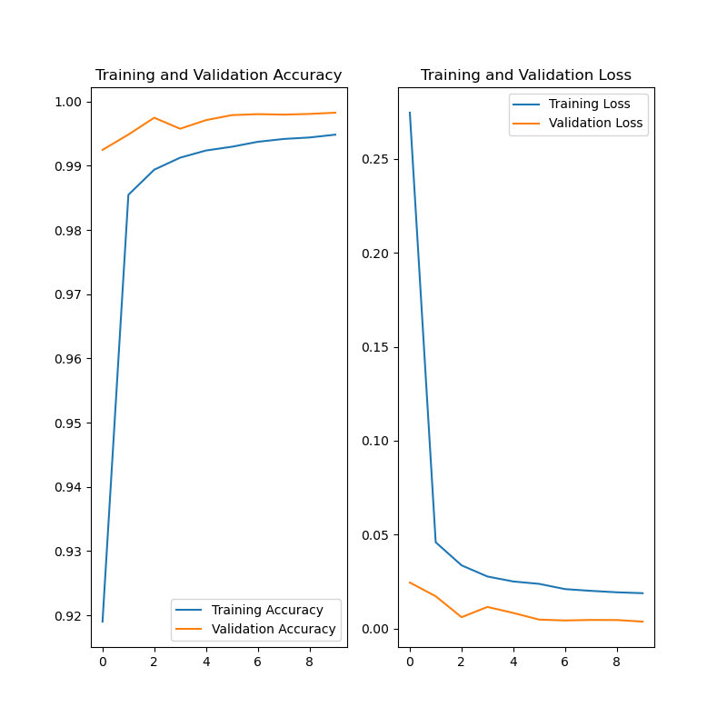

# model
<b>(서버 어류 판별 모델을 위한 디렉토리)</b> 

---
## < Directory Structure Information >
    ./target_images : 어류 판별 테스트를 위한 어류 이미지 디렉토리
    ./디버그용 이미지 : 클라이언트 측에서 어류 판별 기능 테스트를 위한 어류 이미지가 저장 된 디렉토리

    Env test.py : 탠서플로우 환경 테스트
    cv_version.py : OpenCV 테스트
    ---
    AutoKeras.py : 오토 케라스 (최적의 모델 자동 탐색)
    Transfer Learning.py : 전이학습으로 모델 생성
    Dataset Augmentation.py : 데이터셋 증강
    Generate Model.py : 자체 설계 구조로 모델 생성
    Classification.py : 판별 테스트
    ---
    tflite Converter.py : 안드로이드용 tflite 변환
    Add Metadata.py : tflite에 메타데이터 추가
    Metadata Verification.py : tflite의 메타데이터 검증
    ---
    model.h5 : 어류 판별 모델
    model.png : 어류 판별 모델의 학습 과정에서 정확도와 손실율 결과
    model.tflite : 안드로이드용으로 변환 한 어류 판별 모델
    label.txt : 분류(라벨) 내용
    version : 로컬 버전 (클라이언트)과 비교하여 클라이언트 측의 모델 갱신 수행 위한 모델의 버전 관리 파일로서, 서버 측에서 모델 갱신 시 갱신 날짜를 기록한다.

---
## < Current Model Accuracy & Loss Information >

